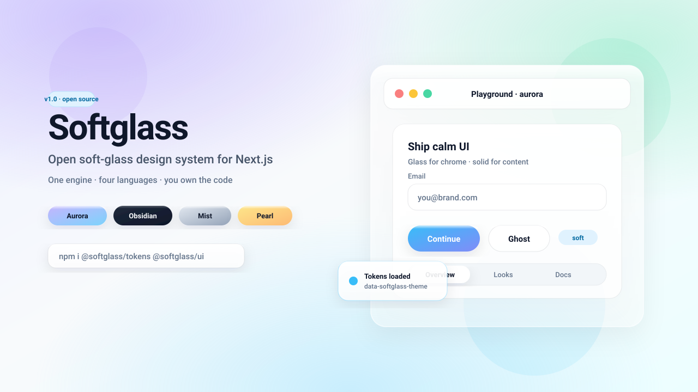

# Softglass

**Open soft-glass design system for Next.js.**

One shared engine · six visual languages (3 dark) · you own the code (shadcn-style intent).



<!-- Hero is hand-authored SVG (docs/assets/hero.svg), not AI-generated. -->


> **Pitch (one line):** Soft glass UI kit with six dialects — pick a language, recolor the brand, ship.

| Language | ID | Scheme | Mood |
| --- | --- | --- | --- |
| Aurora Glass | `aurora` | light | Calm pastel glass — default |
| Mist Panel | `mist` | light | Structural frosted chrome |
| Pearl Soft | `pearl` | light | Warm cream consumer glass |
| Obsidian Gloss | `obsidian` | dark | Premium cyan night glass |
| Noir Velvet | `noir` | dark | Deep black + rose |
| Ember Dusk | `ember` | dark | Warm charcoal + amber |

## What it is (and is not)

| Is | Is not |
| --- | --- |
| Soft-glass **kit** (tokens + React components) | Full Chakra / MUI / Ant replacement |
| MIT + editable CSS variables | Locked closed theme SaaS |
| Next.js App Router first | Framework-agnostic mega-suite (yet) |
| `look` + `motion` design props | Animation playground product |

See [docs/LIMITATIONS.md](./docs/LIMITATIONS.md) for honest v1 boundaries.

## Consumer install (3 steps)

```bash
npm install @softglass/tokens @softglass/ui
```

```css
/* globals.css */
@import "@softglass/tokens";
```

```tsx
// layout: set language
<html data-softglass-theme="aurora">

// any client component
import { Button, Card, Input } from "@softglass/ui";

<Card surface="glass">
  <Input label="Email" />
  <Button>Continue</Button>
</Card>
```

Full walkthrough: [docs/GETTING-STARTED.md](./docs/GETTING-STARTED.md)

**Live packages**

- [`@softglass/tokens`](https://www.npmjs.com/package/@softglass/tokens) · [`@softglass/ui`](https://www.npmjs.com/package/@softglass/ui)
- Repo: [github.com/ArdaDDemir/softglass](https://github.com/ArdaDDemir/softglass) · tag `v1.5.0`

### Brand override (colors only)

```css
[data-softglass-theme="aurora"] {
  --sg-accent: #0ea5e9;
  --sg-accent-hover: #0284c7;
}
```

## Why Softglass exists

Most projects need the **same soft UI grammar** (rounded, glossy, translucent, calm) but not the **same colors**. Softglass separates:

1. **Engine** — radius, spacing, type, glass structure, atoms  
2. **Language** — surface recipes (opacity, blur, gloss, shadows)  
3. **Brand** — accent / semantic color overrides  

So you do not rebuild UI per project. You pick a language and recolor.

## Public model (like shadcn)

- **MIT** license — use, fork, ship commercially  
- **Copy ownership path** — registry sketch in `registry/` (CLI install later)  
- **npm packages today** — `@softglass/tokens` + `@softglass/ui` with dual CJS/ESM `dist`  
- **Not a locked theme kit** — CSS variables you can edit  

## Components (`@softglass/ui` v1.4)

| Layer | Component | Role |
| --- | --- | --- |
| Atom | `Button` | variant, size, rounded, look, motion, loading |
| Atom | `Input` / `Textarea` / `PasswordInput` / `SearchInput` | field meta + chrome |
| Atom | `Badge` / `CountBadge` / `Avatar` | status + identity + counts |
| Atom | `Switch` / `Checkbox` / `Radio` | soft controls |
| Atom | `Select` / `Combobox` / `MultiSelect` | lists + filter-in-menu + async search skeleton |
| Atom | `DatePicker` / `NativeDateInput` / `TimeInput` | date/time (ISO; DatePicker **body portal**) |
| Atom | `Slider` / `RangeSlider` / `NumberInput` / `PinInput` | numeric / range / OTP |
| Atom | `FileField` / `ColorInput` / `ColorSwatch` | files + color |
| Atom | `Progress` / `CircularProgress` / `Meter` / `Spinner` / `Skeleton` | feedback |
| Atom | `StatusDot` / `Rating` / `Alert` | presence + callouts |
| Atom | `Link` / `NavLink` / `Chip` / `CloseButton` / `CopyButton` | chrome |
| Atom | `SegmentedControl` / `ToggleGroup` | exclusive / multi toggles |
| Atom | `Kbd` / `Code` / `Text` / `Heading` / `Highlight` / `Truncate` | docs text |
| Atom | `Label` / `FormField` / `Fieldset` / `CharacterCount` | form composition |
| Atom | `ListItem` / `Icon` / `Image` / `AspectRatio` / `ScrollArea` | layout bricks |
| Atom | `Tooltip` / `Separator` / `VisuallyHidden` / `SkipLink` / `LiveRegion` / `ClientOnly` | a11y & misc |
| Molecule | `Card` / `Modal` / `Popover` / `DropdownMenu` / `ContextMenu` / `Toast` / `Tabs` | overlays & chrome |
| Molecule | `Collapsible` / `Accordion` / `Breadcrumb` / `Pagination` | disclosure & nav (1.4a) |
| Molecule | `EmptyState` / `Sheet` / `HoverCard` | surface (1.4b) |
| Molecule | `Stepper` / `Toolbar` / `List` / `Stat` | structure (1.4c) |
| Organism | `AppShell` | header + optional sidebar |

Full prop map: [docs/API.md](./docs/API.md). Honest limits: [docs/LIMITATIONS.md](./docs/LIMITATIONS.md).

```tsx
import { Button, Card, Input, AppShell } from "@softglass/ui";

<html data-softglass-theme="obsidian">
  <AppShell header={<>…</>} sidebar={<>…</>}>
    <Card surface="glass">
      <Button>Ship</Button>
      <Input label="Email" />
    </Card>
  </AppShell>
</html>
```

## This repo (playground)

```bash
npm install
npm run build:ui   # packages/ui → dist (required once / after UI edits)
npm run dev        # http://localhost:3000
```

| Script | Purpose |
| --- | --- |
| `npm run dev` | Build UI then start playground |
| `npm run build` | UI + Next production build |
| `npm run typecheck` | UI TypeScript |
| `npm run test` | Vitest smokes (`packages/ui`) |
| `npm run pack:check` | `npm pack --dry-run` for both packages |
| `npm run registry:validate` | Generate + validate `registry.json` |
| `npm run registry:build` | Emit `apps/web/public/r/*.json` |

## Repo map

```
apps/web/                 Playground
packages/tokens/          CSS engine + 6 languages
packages/ui/              React components (src → dist)
registry.json             GitHub / shadcn registry entry (root)
registry/                 Synced catalog + notes
apps/web/public/r/        Built registry items (`npm run registry:build`)
docs/assets/hero.svg      README hero (hand-drawn SVG)
docs/GETTING-STARTED.md   Consumer 3-step guide
docs/REGISTRY.md          shadcn CLI / copy path
docs/API.md               Props map
docs/LIMITATIONS.md       Honest v1 limits
docs/LANGUAGES.md         Dialect guide
CHANGELOG.md              Release notes
CONTRIBUTING.md           PR rules
```

## Design rules (non-negotiable)

1. **Glass = chrome**, solid = long content (forms, tables, paragraphs)  
2. **No sharp corners** — soft radius scale  
3. **Gloss = thin top highlight**, not heavy skeuomorphic buttons  
4. **Mobile**: lower blur, fewer stacked glass layers  
5. Respect `prefers-reduced-transparency` and `prefers-reduced-motion`  

## Status

**v1.5.0 — shipped** (shell · patterns · date range · 6 languages · gallery)

- [x] Six languages as CSS tokens (obsidian · noir · ember dark family)  
- [x] Core UI kit + look + motion  
- [x] Dual `dist` for `@softglass/ui` (ESM `.mjs` + CJS `.js`, `.d.mts`/`.d.ts`)  
- [x] Consumer getting-started + limitations + changelog  
- [x] CI workflow (typecheck + **test** + build + pack dry-run)  
- [x] npm org **`softglass`** (owner: personal **ardaddemir** — not work/Feedemy)  
- [x] GitHub [ArdaDDemir/softglass](https://github.com/ArdaDDemir/softglass) · `main` includes 1.3 + 1.4  
- [x] v1.1–1.2 kit (overlays, ContextMenu, DatePicker, portals, Vitest)  
- [x] **v1.3 atom layer** — feedback / form / chrome atoms  
- [x] **v1.4 molecule set** — Accordion, Sheet, Stepper, List, Stat, … + DatePicker body portal  
- [x] Publish **`@softglass/tokens@1.5.0`** → **`@softglass/ui@1.5.0`** + tag **`v1.5.0`**  

**Next (when ready):** v1.5 organism & product patterns (shell depth, PageHeader, CommandPalette minimal).  
See [docs/claude/todos.md](./docs/claude/todos.md) when present on a plan branch.

**Account rule:** `gh` = **ArdaDDemir**, `npm whoami` = **ardaddemir**. Never publish or push Softglass from work/Feedemy.

## Package naming

| Package | npm | Notes |
| --- | --- | --- |
| [`@softglass/tokens`](https://www.npmjs.com/package/@softglass/tokens) | **1.5.0** | CSS engine + 6 languages + shell chrome |
| [`@softglass/ui`](https://www.npmjs.com/package/@softglass/ui) | **1.5.0** | React components (peer: react, tokens **^1.5**) |
| `softglass` (unscoped) | unused | we ship **scoped** packages only |

Install:

```bash
npm install @softglass/tokens @softglass/ui
```

## Contributing

See [CONTRIBUTING.md](./CONTRIBUTING.md). Keep PRs focused.

## License

MIT — see [LICENSE](./LICENSE).
